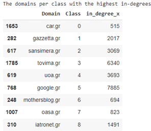
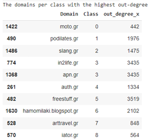

# Table of Contents

1. [Project Scope](#1-project-scope)  
2. [Data](#2-data)  
   2.1 [Data Preprocessing](#21-data-preprocessing)  
   2.2 [Data Exploration](#22-data-exploration)  
   2.3 [Text Representation](#23-text-representation)  
   2.4 [Graph Representation](#24-graph-representation)  
3. [Modelling](#3-modelling)  
   3.1 [Parameter Optimization](#31-parameter-optimization)  
   3.2 [Benchmark](#32-benchmark)  
   3.3 [Final Model](#33-final-model)  
   3.4 [Model Trials](#34-model-trials)  
4. [Further Improvements](#4-further-improvements)

## 1. Project Scope 
The goal of the project is to perform **Classification** on a collection of data that represent Web Domains.  

Specifically, the purpose is to apply **Machine Learning Techniques** in order to predict which Class represents each Domain most optimaly.  

This task can be classified in the problem categories of Text Classification combined with Node Classification,  
since the data not only contain **Textual Representation** of the websites but we also obtain a **Graph** of the domains based on the links between them.  

## 2. Data 
  The data provided for text classification consist of Greek domains. It consists of four main 
directories: 
- **Domains.zip**: This file contains the textual content of the domains that are included 
in our project.  
- **Edgelist.txt**: This file contains a large part of the Greek web graph stored as an edge
list. The nodes represent the domain names and edges represent the hyperlinks that 
can be found in the domain. 
- **Train.txt**: This file contains the domain names that will constitute the train set of the 
classification task. These domains are already classified in one of the 9 classes, which 
represent the theme of the domain.  
- **Test.txt**: This file contains the domain names that will constitute the test set of the 
classification task. Similarly, each of these domain names belongs to one of the 9 
possible classes. There are the domains which the models will be evaluated on, on 
Kaggle. 

## 2.1 Data Preprocessing

  In order to clean up the text, we perform preprocessing suitable for natural language processing (NLP) tasks. Specifically, we utilize the **Greek language model from spaCy**, which includes components necessary for tasks such as tokenization, part-of-speech tagging, and lemmatization specific to the Greek language. Using a pre-trained model ensures accurate and efficient processing of Greek text by leveraging spaCy's robust NLP capabilities.

The preprocessing steps are as follows:

1. **Truncation**  
   We truncate the textual representations of the domains to an upper limit for both memory efficiency and to discard noise in the data. The chosen upper limit is the **average text length of 10,095 tokens**.

2. **Removal of Line Breaks and URLs**  
   We remove newline characters and URLs, which are common in the texts due to the nature of the data.

3. **Normalization**  
   Accents are removed (due to the Greek language), and all characters are converted to lowercase. This step supports text normalization and aligns with the requirements of the embedding model used later.

4. **Lemmatization and Filtering**  
   Each token is:
   - Lemmatized to reduce it to its base form
   - Filtered to remove non-alphabetic tokens
   - Stripped of stop words and tokens with fewer than three characters
    Lemmatization helps unify different word forms and reduces noise, while filtering retains only meaningful words—important in Greek, where short words often carry  little semantic value. This results in more compact and computationally efficient text representations.

This preprocessing pipeline as described above effectively prepares Greek text for the 
following classification tasks, by ensuring the domain data is consistent, simplified, and 
focused on meaningful content. 
All the steps above are performed on the train and test domains, separately.  

## 2.2. Data Exploration

Following on our analysis, we perform Data exploration to better understand the available data.  
To do so, we combine the information from the textual context of the domains and the  information from the graph and the connectivity of the nodes.  

Starting on our analysis, we study the class distribution of the train dataset.  As we can see on the figure below, the classes are highly imbalanced.  
The **Class 3** seems to have the **highest percentage** of the train samples, while the **Classes 0, 6 and 7** have the **lowest percentages**.

In order to gain a better understanding on the classes and what each one of them represents, we analyze more the domains in each class.  
As we can see below, we print indicatively **10 domains** of each **class**.

We can already detect a theme for each class, but we also print the **top words** that appear  
most frequently in each class and have relatively large length, over 10 letters. 
In the below image we can see indicatively some of them.

Following, we focus more on the graph information in our data. First of all, the graph of all  
the domains consists of 65,208 nodes and 1,642,073 edges.

- **In-degree**: This metric represents the number of incoming edges to a node.  
  Therefore, it can indicate how popular a domain can be, based on how many other  
  domains point at it.

- **Out-degree**: This metric denotes the number of outgoing edges from a node.  
  Therefore, nodes with high out-degree are possibly nodes that are very active in  
  making connections and they could be seen hubs that frequently point to other  
  nodes.

- **Average neighbor degree**: This measure indicates the average degree of a node's  
  neighbors. For a node *v*, the average neighbor degree can be computed by averaging  
  the degrees of all nodes that are adjacent to *v*. So, nodes with high average neighbor  
  degree means that they are connected to other nodes that themselves have a high  
  degree. This can indicate that the node is part of a well-connected or influential  
  neighborhood within the graph.

After computing this information, we study the nodes with the highest in-degree, out-
degree and average neighbors’ degree per Class.

  

  

  

As we can see from the above, and especially from in-degrees and out-degrees results, there
seem to be a clear theme for each Class. If we combine all of the above insights we can
conclude the following:

Image Classes Description.

Next in our analysis, we study the communities that are formed on the train domains in each of the 9
Classes. To do so we utilize the Louvain method, which can provide valuable insights into the
structural organization and cohesiveness of the nodes within each class and we calculate the number
of communities per Class.

Image 7 : Number of Communities in the train domains, per Class

The number of communities detected in each class indicates how the nodes within each
class are grouped based on their connections. In our data, the numbers range from 7 to 11

communities per class, however there is no huge difference between the classes. Some
remarks on that:

- **Classes with Higher Number of Communities (10-11):** 
    Classes 0, 1, 2, 5, and 8 have
    more communities than the rest. This might suggests that these classes have a more
    complex structure with multiple distinct subgroups. These classes may have more
    diverse or varied content, leading to the formation of more subgroups within the
    network, which could represent different themes, or areas of interest.
- **Classes with Fewer Communities (7-9)** : Classes 3, 4, 6, and 7 have fewer
    communities. This indicates a more cohesive structure with fewer groups. These
    classes might have more homogenous content or stronger interconnections among
    the nodes, resulting in fewer, more significant clusters.

Finally, before we continue with the rest components of the model development, we print some
informative statistics on the train and test dataset, but also per each of the Classes.

Image 8 : Statistics on the textual representation of the domains

The vocabulary size is quite large, reflecting a rich and diverse set of words used across the
textual content of the domains. However, there are 30,428 out-of-vocabulary (OOV) words
in the test set, which is significant. This could imply that there are many words in the test set
that the model has not seen during training, potentially affecting the model's ability later on
to accurately interpret test data.

Generally, the average lengths of the texts per class seem similar. However, Class 3 has the
highest average document length (3, 813 tokens), indicating that documents in this class tend
to be longer and possibly more detailed. As a reminder, this Class seems to contain domains
from the “News” domain, so this can explain this fact.

## 2.3. Text Representation

After the data preprocessing & exploration, we continue with creating a valid representation
of the text data, in order to use them in the classification models. There are various choices
on this area (e.g., tf-idf representation, embeddings using pretrained Greek model from fast-
text), but the most helpful representation was achieved by utilizing pre – trained models
based on BERT and extracting the embeddings of the words in our text.

As we know, BERT provides embeddings with contextual information, allowing them to
capture the meaning of words based on their surrounding context, which often leads to
more accurate representations for downstream tasks. Furthermore, due to the limited
availability of high-quality models for Greek text, using BERT embeddings becomes crucial as
it outperforms other models (e.g. fast-text that was also used, did not result in good
performance).

Specifically, since the textual representation of the domains is in the Greek language, we
used a Sentence Transformer based on the Greek media Bert model^1. This model was
trained on a custom dataset containing triplets from the combined Greek “internet”, “social-
media” and “press” domains. The dataset was created by sampling triplets of sentences
from the same domain, where the first two sentences are more similar than the third one.
Training objective was to maximize the similarity between the first two sentences and
minimize the similarity between the first and the third sentence.

By utilizing this pre-trained model, each sentence is mapped to a 768 - dimensional dense
vector space, which will be used as input to our classification models later.

It should be noted, that besides this transformer, we tested another Bert based model,
which is also trained in Greek texts^2. Specifically, we obtained the embeddings of the tokens
of each sentence and produced the sentence embedding by averaging the tokens’
embeddings. However, by comparing the performance of these embeddings with the
embeddings produced from the Sentence Tokenizer on our baseline model (Simple Logistic
Regression model, described below), we concluded that the Sentence Tokenizer embeddings
produce more accurate representations. This discrepancy between those two might be due
to the way these models were trained or the data that were used, since the Sentence
Tokenizer mentions that it was trained on social media data and press domains, which might
be more similar to our data.

Therefore, to conclude each sentence/record is of shape (768,) and therefore our initial
training set consists of 1,812 sentences of size 768.

## 2.4 Graph Representation
Up to here, we have managed to represent the textual information of the domains; however
we also need to capture information from the graph, in order to make the classification
more accurate.

Specifically, we capture the connectivity of the nodes – domains in the graph based on the
following methodology:
- Firstly, we generate **random walks** (20 random walks with max depth of 40 nodes)
for nodes in the graph. Each walk starts from a domain node and randomly traverses
neighboring domains, capturing local domain relationships.
- Then, we represent each random walk sequence as a “text” document, where nodes
visited in the random walk correspond to “words” in the text. We utilize and train
Word2Vec model to learn embeddings for each node based on these sequences,
capturing the structural information of the graph and contextual relationships
between domains. This **Word2Vec** model is a skip-gram model which basically learns
to predict the neighboring domains given a domain, and we use a window size of 10,
meaning the model considers 10 neighboring domains on each side of the domain
during training.

Therefore, from the procedure above, each domain node in the graph will be represented by
a dense vector of size **(128,)** which is our chosen embedding size in the **Word2Vec** model,
capturing the structural information and relationships with other domains in the graph.
In addition to using random walks for generating node embeddings, we also incorporate
structural features for each domain node
Specifically, we utilize the **in-degree**, **out-degree**, and **average neighbor degree**. These
features are also explained in the Data Exploration analysis, however in general they provide
information about the connectivity of nodes, as the in-degree represents the node
popularity within the network, the out-degree represents the node's activity and finally the
average neighbor degree provides insights into the connectivity of a node's neighbors,
helping to understand the local network density around the node.
We also extracted an additional feature **(1,)** by converting the graph to an undirected graph
and partitioning the nodes into communities based on their connectivity patterns using the
Louvain algorithm.
Combining these four features with the learned **embeddings** from **Word2Vec (deep walks)**,
we get node representations of size **(132,)**, which will later be used in the modeling process.

## 3. Modelling
In this section, we describe the developed final model and some trial models that achieved a
satisfactory score. We aimed to leverage both textual information and graph structural
features in order to achieve high classification accuracy. To achieve this, we developed the
following model architecture that effectively integrates both the text and the graph data,
enabling comprehensive analysis and capturing the interplay between textual content and
network structure for improved performance.

## 3.1. Parameter Optimization
In order to find the optimal hyper – parameters that could be used in the models developed
and mentioned below, we opted to perform tuning using the Optuna framework3. Optuna is
an open-source optimization library, which searches the optimal solution by trial and error in
the search space that is defined by us (by defining the lower value, the upper value and the
step size (wherever needed) of each hyper-parameter), and it automatically prunes
unpromising trials for faster results.
Specifically, it leverages a history of past trials to inform subsequent hyperparameter
selections. By analyzing this historical data, it identifies promising regions of the
hyperparameter space to explore further. This iterative refinement is driven by a Bayesian
optimization algorithm, which enables efficient and effective hyperparameter optimization.
For this project, we defined a maximum of 50 trials for the hyperparameter optimization
process.

## 3.2. Benchmark
In order to obtain a benchmark model and initially check the performance of our chosen
features in the text classification process, we train and evaluate a simple Logistic Regression
model.
On our first trial, we utilized as input to the model only the text embeddings and the results
can be seen below. As expected, the performance is not optimal as it achieves an accuracy
of 58% and a macro f1-score of 59%.

IMAGE BENCHMARK

We should also note that we examined the Logistic Regression performance using SVD on
the text representations, to reduce the dimensionality of the text features before feeding them 
into the logistic regression classifier and reduce any possible noise that is present in
our data. The number of features we tested varied from 100-200, which they explained over
95% of the variance. However, the performance was not improved, so the SVD was not
further used.

## 3.3 Final model
In this section, we present the architecture of our modeling approach, which produced the
model with the best performance.
Specifically, this architecture sequentially utilizes three different models. The output of each
model serves as the input to the subsequent model, with additional features incorporated at
each stage. A high – level representation can be seen below:

image final model

### Model 1: MLP using text embeddings
Starting the modeling process, we decide to train a MLP model that takes as input features
the text embeddings produced using the Sentence Tokenizer, of size (768,). We firstly split
the data into 90% train and 10% validation sets, in order to evaluate the generalization
power of each model. Then, we define the search space to be used in the Optuna
framework, where we define the max trials as 50:

IMAGE MLP PARAMETERS

For the training process, we also utilize Early Stopping in order to avoid the overfitting of the
model, using as patience 5 epochs and then we train the model for 100 epochs. The model
with the best hyper-parameters is the following, which achieves a train loss of 0.8964 and a
validation loss of 1.0685:

IMAGE

From the above plots we can see that after around 20 epochs, the training and validation
loss curves start to converge, indicating that the model is stabilizing. However, the training
loss continues to decrease, while the validation loss shows a slight increase towards the end,
indicating potential overfitting. Besides the Early Stopping mechanism we used, which
worked and stopped the training at around 40 epochs, we could utilize Regularization
methods or increase the dropout rate.

Using the validation dataset, we evaluate the trained MLP model, which leads to the
following results. As we can see, this model already outperforms the Logistic Regression
used as baseline, which was expected.

IMAGE CONF MATRIX

### Model 2: MLP using the output of Model 1 combined with  representations
After training the best-performing MLP on the first step, we obtain the probability
distribution it produces for each input, which has a size of (9,) corresponding to our 9
classes. This probability distribution reflects the confidence of this model in assigning each
input to the classes. In order to further enhance our model's performance, we introduce the
additional -based features.
Specifically, we create the  representation as described in the respective section
above. This representation consists of feature vectors of size 128, derived from Word2Vec
application on random walks, along with the three-node metrics: in-degree, out-degree, and
average neighbors' degree and the (1,) vector that indicates the partition. These combined
vectors, totaling a size of 132 (128 + 3+1), capture the structural properties and connectivity
information of the nodes within the .
This combined input for the second MLP, is thus formed by concatenating the probability
distribution from Model 1 with the  representation vectors. The purpose of using the
probability distribution from Model 1 as an input to Model 2 is twofold. Firstly, it enables
Model 2 to build upon the initial classification, leveraging the probabilistic information that
reflects the initial model's confidence in class assignments. Secondly, by integrating this
probabilistic data with -based features, Model 2 can refine its understanding of the
input data, potentially capturing more complex relationships and dependencies that the
initial model might have missed.
Following, using the approach described earlier, we scale the input vectors since the
features are on a different scale, where the probabilities range from 0 to 1 and the 
representation features are much larger numbers. We tried both no scaled and scaled input
data, and we saw that scaling helped in the convergence of algorithms and resulted in better
results (val loss and accuracy).
Again, as of Model 1, we define the same search space for the Optuna framework to utilize
and find the best hyper – parameters, by performing 50 trials at maximum and we utilize
Early Stopping. The model with the best hyper-parameters is the following, which achieves a
train loss of 0.2842 and a validation loss 0f 0.7445:
IMAGES

We could mention that:
- We also developed and tested one MLP model (instead of 2) that integrates text
embeddings and -based features. Specifically, we truncated the text
embeddings to a 100-dimensional space and combined them with 132 -based
features, creating a comprehensive feature set to capture both textual and
structural information. We ultimately decided to abandon this model, which
combined truncated 100-dimensional text embeddings with 132 -based
features, as its performance on the submission test was slightly lower compared to
the alternative model.
IMAGE
- Furthermore, we tested a Logistic Regression model using same features set. The
model's performance improved significantly with these enhanced features
compared to the benchmark Logistic Regression and achieves accuracy of 68%;
however it remains worse than the MLP model 2.
IMAGE

### Model 3: GCN using the output of Model 2 combined with graph representations
As a final model, we decided to use a Graph Convolutional Neural Network (GCN) model,
which is suitable for data similar to those used in this project, since they are a class of neural
networks specifically designed to work with graph-structured data.
More analytically, GCNs is a powerful technique for extracting and summarizing node
information within a graph structure. It is derived from the convolution operation used in
Convolutional Neural Networks (CNNs), which are commonly applied to image data.
In GCNs we create features for each node, and we store them in a feature matrix for
efficiency purposes. Like almost every Graph Deep Learning Architecture, the GCN also
has two key processes: Message passing and Update. In GCNs, the message passing, and
aggregation step involves aggregating features from neighboring nodes and the node itself
(a weighted sum of the feature vectors of the neighbors). 
To ensure appropriate scaling, we use a normalized adjacency matrix. The update rule combines the aggregated features with
a learnable weight matrix and applies a non-linearity function.

The combination of these steps in multiple layers allows GCNs to effectively capture the
structural information of the graph and learn meaningful node embeddings.

More specifically, regarding the input features, we should note that since the entire graph is
used as data, features should be created for all nodes. Therefore, for the nodes where we
have data available, we utilize the probability vector of size (9,) which is produced from the
Model 2 and the 128-dimensional vectors produced from the random walks using
Word2Vec (as explained in the respective section). For the nodes where we do not have
data, we generate 9 random values between 0 and 1, and also use the 128-dimensional
vectors the random walks using the Word2Vec model. The use of those embeddings which
contain Topological Context is a better alternative to the creation of random features. With
our approach, the model has information even before the beginning of its training.
The architecture of the GCN consists of two GCN layers followed by a fully connected layer.
In the forward pass, the input features propagate through the first GCN layer, followed by a
ReLU activation function and dropout for regularization. Then the output passes through the
second GCN layer with similar activation and dropout. Finally, the output is fed into a linear
layer to produce class scores, which are then passed through a log-softmax function to
obtain output probabilities over classes. We train the model for 150 epochs. The hyper-
parameters used to train the model are the following:

image

The results can be seen below. The model achieves a train loss of 0.7550 and a validation
loss of 0.9162. From the plot of train and validation loss, we can see that the issue of
overfitting seems to be resolved or at least is less present.

image

Using the validation dataset, we evaluate the model produced, which leads to the following
results. As we can see, this model achieves accuracy at 71% and a f1-score of 68%.

image

We should notice that even though the accuracy is slightly less than the previous MLP
model, the overfitting issue seems to be better in this model.
By utilizing the probability distributions produced from this model for the unknown test
set, we achieve a Private loss of 0.9196 and a Public loss of 0.8620 on the Kaggle
submission.

## 3.4 Model Trials

### • Modeling Trials:
- We initially tested models using different feature sets independently:
  - MLP model using the text embeddings alone.
  - MLP model using graph-based features alone, both with and without Louvain community labels.

### • Combined Feature Models:
- We experimented with combining text embeddings and graph-based features:
  - MLP model using the full text embeddings (768,) combined with graph-based features.
  - MLP model using the truncated text embeddings (100,) combined with graph-based features.

### • Feature Scaling:
- For every feature set combination, we evaluated the model performance both with and without feature scaling to assess its impact on results.

Best Model Identification based on the final leaderboard results
After the private results were revealed on Kaggle post-competition, we observed that our
best model achieved a score of 0.8735. However, this model was not selected for evaluation
because its public score on a sample of the test set (0.9881) was lower than our best
submission's public score (0.8929).
The best predictions were the output of the second MLP model, using the described
approach, combining the predicted probabilities with the graph-based features of size (141,)
# 4. Further Improvements
For further improvements, several strategies could be explored to address observed
limitations and enhance model performance.
➢ Firstly, given the indications of overfitting observed in our models, implementing
regularization techniques such as batch normalization layers in the MLP
architectures could help mitigate this issue.
➢ Additionally, to address discrepancies between validation and test losses,
techniques such as cross-validation could be employed for fine-tuning, providing a
more robust assessment of model performance across different data splits.
➢ Moreover, to handle the imbalanced dataset, approaches like data augmentation or
random sampling could be employed to ensure better representation of minority
classes.
➢ Exploring advanced feature engineering methods such as topic modeling to extract
topic distributions from texts, instead of relying solely on text model’s predicted
probability distributions, could enhance the model's ability to capture nuanced
information.
➢ Lastly, for improving graph-related features, incorporating additional measures such
as PageRank or other centrality metrics could provide richer representations of node
importance and connectivity within the graph structure.
